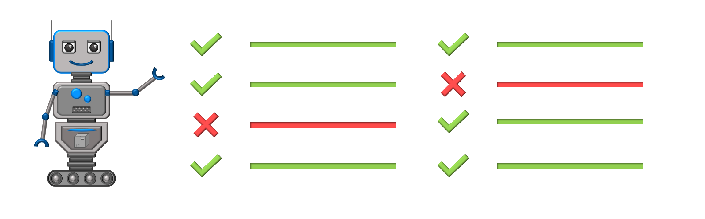

# Data Pack Checker

|--:|
© _2021, Bertie2011_

This project is a dynamic rule-based style checker CLI for Minecraft Data Packs.

### View [the wiki](../../wiki) for more information or go straight to [the releases](../../releases).
